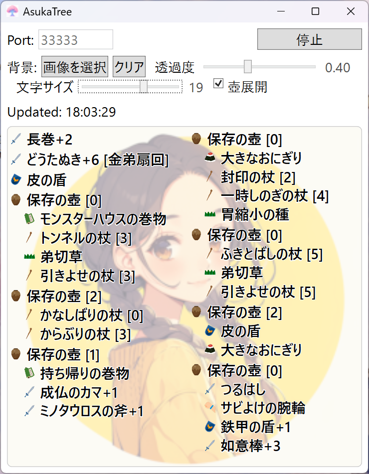

# AsukaTree

  

AsukaTree は、[AsukaTools](https://web.archive.org/web/20241015162142/http://www.lapcie.com/index.php?page=AsukaTools) の HTTP 機能を利用して、所持アイテムのデータ取得した後、見やすく整形してウィンドウに出力する windows のデスクトップアプリです。

利用には HTTP 機能が有効化されている version 2.3 以降の AsukaTools が必要です。

## 動作環境

-  Windows 11（64bit)
	- 多分 Windows 10 でも動くと思うけど未確認です

:warning: AsukaTree は現在 **ベータ版** です。  
基本的な機能は動作しますが、UI や挙動に未調整な部分や想定外のケースが残っている可能性があります。
不具合や改善案などがあれば、Issue や Pull Request で教えてもらえると助かります。

## 利用方法

AsukaTools 側の設定(初回だけ)
1. 設定->AsukaTools->HTTP機能 でポートを `33333` に指定
1. AsukaToolsを再起動する

AsukaTree を使う
1. [releases](https://github.com/dolores-jp/asuka-tree/releases) の任意のバージョンの Assets から `AsukaTree_***.zip` をダウンロード
1. ダウンロードした ZIP を解凍
1. `AsukaTree.exe` を実行
1. 右上の `開始` ボタンをクリックするとアイテムリストの同期が開始されます

## 著作権・ライセンスについて

- 本アプリケーションのコードは MIT License の下で公開されています
- アプリケーションアイコンは AsukaTree 用に制作されたオリジナルデザインです
- 背景画像/アイテム種別アイコンなどの外部素材は本リポジトリには含まれていません
- ユーザーが読み込む画像やデータの著作権は、それぞれの権利者に帰属します
